<div align="center">
  
</div>

# bi-agent-kit

<div align="center">
  <a href="https://www.npmjs.com/package/bi-agent-kit"></a>
  <a href="https://github.com/kae-labs/bi-agent-kit/actions/workflows/test.yml"></a>
</div>

**A configurable installer for AI-agent tooling aimed at Business Intelligence work.**

<div align="center">
  
</div>

`bi-agent-kit` installs BI-related MCP server entries into the config files of the AI coding tools you already use -- Claude Code, Cursor, Gemini CLI, GitHub Copilot, and more -- without ever touching anything else already in those files.

CI runs the full test suite on both Linux and Windows (Node 20.x and 22.x) on every push and pull request.

Pick the servers you want, pick which tools to wire them into, and `bi-agent-kit` handles the rest: safe merges, atomic writes, an interactive walkthrough for anything that needs your own account details, and a manifest so entries can be cleanly added or removed later.

## Usage

No install step required.

```
npx bi-agent-kit init
```

Detects which supported AI tool config files exist in your project and your home directory, lets you pick which BI servers to add to which of them, walks you through any setup values a server needs (an org URL, a connection string, a token), and writes a manifest so it can cleanly add or remove entries later.

```
npx bi-agent-kit configure
```

Re-opens the same picker with current selections pre-checked, adds anything newly selected, and removes anything deselected -- as long as that entry has not been hand-edited since install.

```
npx bi-agent-kit remove <spec...>
```

Removes one or more installed servers by spec (`templateId` or `templateId:instanceName`, e.g. `npx bi-agent-kit remove dataverse:dev powerbi`) from every target it was installed into, and updates the manifest. A spec that matches nothing installed is reported, not an error.

```
npx bi-agent-kit export --out team.json
```

Prints (or, with `--out`, writes) a portable JSON document describing your current server selections as `spec`/`targetIds` pairs -- no absolute paths, no placeholder values, no secrets -- so it is safe to commit or share with teammates.

```
npx bi-agent-kit init --from team.json
```

Reads a document produced by `export` and installs the same servers into the same target ids non-interactively, resolving target ids against whatever is detected on the current machine. Target ids not detected locally are skipped with a warning rather than failing the run, so a team-shared `team.json` works across machines with different tool setups.

```
npx bi-agent-kit list
```

Shows what `bi-agent-kit` currently has installed, and where.

```
npx bi-agent-kit doctor
```

Health-checks everything previously installed: the manifest, each config file, whether entries were hand-edited or removed outside `bi-agent-kit`, whether required CLIs are still on PATH, and whether any setup placeholder was never filled in. Exits nonzero if anything is broken.

```
npx bi-agent-kit reconfigure
```

Picks an already-installed entry from a list and re-runs its setup walkthrough in place -- useful when an org URL, connection string, or token changes, or when you left a placeholder unfilled the first time. It re-applies the entry's own value into the same config file and target under the same key, so the diff on that file is just the values that changed.

### Flags

| Flag | What it does |
|---|---|
| `--dry-run` | Preview exactly what `init`/`configure`/`reconfigure` would write or remove; nothing is touched and no setup questions are asked |
| `--servers <ids>` | Non-interactive: comma-separated server specs to install (e.g. `--servers powerbi,fabric`), skipping the picker. Adds or updates the listed servers without touching any others already installed |
| `--prune` | With `--servers`, remove anything not listed instead of only adding/updating (full-sync semantics) |
| `--targets <ids>` | With `--servers`, restrict installation to specific target ids |
| `--out <file>` | With `export`, write the document to a file instead of stdout |
| `--from <file>` | With `init`, import a portable `export` document and install non-interactively |
| `--yes` | Skip confirmation prompts (never auto-runs installers) |
| `--json` | Machine-readable output for `list` and `doctor` |
| `--help`, `-h` | Usage for every command and flag |
| `--version`, `-v` | Print the version |

Non-interactive mode never prompts for setup values: placeholder tokens are left in place with a warning so you can fill them in afterward, which makes it safe for scripts, devcontainer hooks, and CI.

### Instances -- multiple environments or accounts of the same server

A server spec is either a plain template id (`dataverse`) or `templateId:instanceName` (`dataverse:dev`), where `instanceName` is letters, numbers, and hyphens. Each named instance gets its own key in the config file (`dataverse-dev`, `dataverse-prod`, ...) and its own entry in the manifest, so it can be configured, reconfigured, and removed independently of any other instance of the same server. `configure` preserves existing instances by default -- pass `--prune` if you want it to remove any instance not listed in `--servers`.

```
npx bi-agent-kit init --servers dataverse:dev,dataverse:prod
```

installs two Dataverse MCP entries side by side -- `dataverse-dev` and `dataverse-prod` -- each walking you through its own org URL.

This is for the case where one template genuinely needs more than one live configuration at once: a dev and a prod Dataverse environment, two Fabric workspaces, two SQL Server or Snowflake accounts, a personal and a client Postgres database. In the interactive picker, choosing a server that is already installed at a target offers **Keep as is**, **Reconfigure values**, or **Add as a new named instance** -- the last option prompts for an instance name and installs alongside the existing entry rather than replacing it.

`list` and `doctor` render instance keys as-is (`dataverse-dev`, not `dataverse`), so each instance's health and installed-date show independently.

### End-to-end example

```
$ npx bi-agent-kit init

  Select which BI servers to install
  > [x] Power BI MCP      Semantic model authoring (TMSL/TOM)
    [x] Dataverse MCP     Dataverse hosted MCP endpoint
    [ ] Fabric MCP        Fabric REST APIs and workspace operations

  Select which detected config files to install them into
  > [x] Claude Code (project)   .mcp.json
    [ ] Cursor (user)           ~/.cursor/mcp.json

  Enter a value for your org url (config.args.3)
  > https://yourorg.crm.dynamics.com

  add powerbi at .mcp.json: written
  add dataverse at .mcp.json: written
```

Then ask your AI tool to do real BI work -- the servers are already wired in:

> "List the tables in my Dataverse environment and draft a Power BI measure for monthly active users."

(Illustrative CLI sketch; exact prompt rendering comes from the interactive picker.)

## Supported AI tools

| Tool | Scope |
|---|---|
| Claude Code | project + user |
| Claude Desktop | user |
| Cursor | project + user |
| Gemini CLI | project + user |
| GitHub Copilot CLI | project + user |
| GitHub Copilot -- VS Code extension | workspace + user |
| OpenAI Codex CLI | project + user |
| Windsurf | user |
| Roo Code | project |
| JetBrains Junie | project + user |

The Claude Code VS Code extension shares the CLI's configuration files, so Claude Code support covers the extension automatically.

## Supported BI servers

| Server | What it is | Link |
|---|---|---|
| **Power BI MCP** | Semantic model authoring (TMSL/TOM) | [microsoft/powerbi-modeling-mcp](https://github.com/microsoft/powerbi-modeling-mcp) |
| **Dataverse MCP** | Dataverse hosted MCP endpoint | [Connect to Dataverse with MCP](https://learn.microsoft.com/en-us/power-apps/maker/data-platform/data-platform-mcp) |
| **PAC CLI MCP** | Built into the Power Platform CLI | [Power Platform CLI MCP server](https://learn.microsoft.com/en-us/power-platform/developer/howto/use-mcp) |
| **Fabric MCP** | Fabric REST APIs, item definitions, workspace operations | [Fabric MCP Server quickstart](https://learn.microsoft.com/en-us/rest/api/fabric/articles/mcp-servers/pro-dev-local/get-started-local) |
| **Azure MCP** | Broad Azure resource management (Storage, Key Vault, Cosmos DB, Azure SQL, and more) | [@azure/mcp on npm](https://www.npmjs.com/package/@azure/mcp) |
| **dbt MCP** | Build, run, docs, and lineage for a dbt project | [dbt-labs/dbt-mcp](https://github.com/dbt-labs/dbt-mcp) |
| **SQL Server MCP** | Azure SQL, SQL Server, PostgreSQL, MySQL, and Cosmos DB via Data API Builder | [SQL MCP Server quickstart](https://learn.microsoft.com/en-us/azure/data-api-builder/mcp/quickstart-visual-studio-code) |
| **Snowflake MCP** | Snowflake-managed remote MCP server (Cortex Agents) | [Snowflake MCP Server docs](https://docs.snowflake.com/en/user-guide/snowflake-cortex/cortex-agents-mcp) |
| **Postgres MCP** | Postgres database inspection, query, and index-tuning (Postgres MCP Pro) | [crystaldba/postgres-mcp](https://github.com/crystaldba/postgres-mcp) |

Eight of the nine are official, first-party servers from Microsoft or Snowflake, or maintained directly by the tool vendor (dbt Labs). Postgres MCP is the best-maintained community alternative, since no first-party Postgres MCP server exists. None are roadmap-only.

A weekly scheduled workflow (`.github/workflows/freshness.yml`) checks that every template's referenced registry package (npm or PyPI) still exists, so a renamed or unpublished upstream package is caught before it breaks an install.

## Safety

`bi-agent-kit` never overwrites a config entry it does not already own. Before writing, it checks every target for a server already configured under the same name -- if you already have it set up by hand, or by some other tool, `bi-agent-kit` skips that entry entirely and leaves it exactly as it is, rather than overwriting or duplicating it. Every write is atomic, and the first time a target file is touched, a backup copy is kept in a `.bi-agent-kit-backups/` directory next to it.

That backups directory writes its own `.gitignore` (`*`) the first time it is created, so backups -- including any hand-configured secrets a pre-existing config file already had in it -- are excluded from version control regardless of your own `.gitignore` state.

Servers that require an external CLI to already be installed (PAC CLI for PAC CLI MCP, the `dab` CLI for SQL Server MCP, `uvx` for Postgres MCP) are flagged inline in the picker with a "not found on PATH" label if that CLI is not detected -- they are still offered, since you may install it before running the picker again, but the warning makes the missing prerequisite visible up front.

If you answer a setup question with a value that looks like a secret (a connection string, token, key, PAT, secret, or password), and it gets written into a config file inside your project, `bi-agent-kit` checks whether that file is gitignored and prints a warning if it is not, so you notice before committing a credential.

## Prerequisite setup

When `init` or `configure` finds a required CLI (`pac`, `dab`, or `uvx`) missing from PATH, it offers to install it for you right there in the picker -- confirm and it runs the appropriate command for your platform (a `dotnet tool install` for `pac`/`dab`, the official installer script for `uvx`), then re-checks PATH and reports success or failure. Decline and it falls back to the existing inline "not found on PATH" label.

After PAC CLI MCP is installed or detected and configured, `bi-agent-kit` also offers to walk you through a `pac auth` profile: it runs `pac auth list` so you can see what is already configured, and if you confirm, offers to run `pac auth create` (optionally scoped to an environment URL you provide) -- this opens an interactive browser login, so a note is printed before it starts.

`--dry-run` skips all of this: no install offers, no `pac auth` walkthrough, and no setup questions are asked.

## License

MIT

---

Built by [KAE Labs](https://kaelabs.dev) -- an independent studio for applied AI, data, and software.
