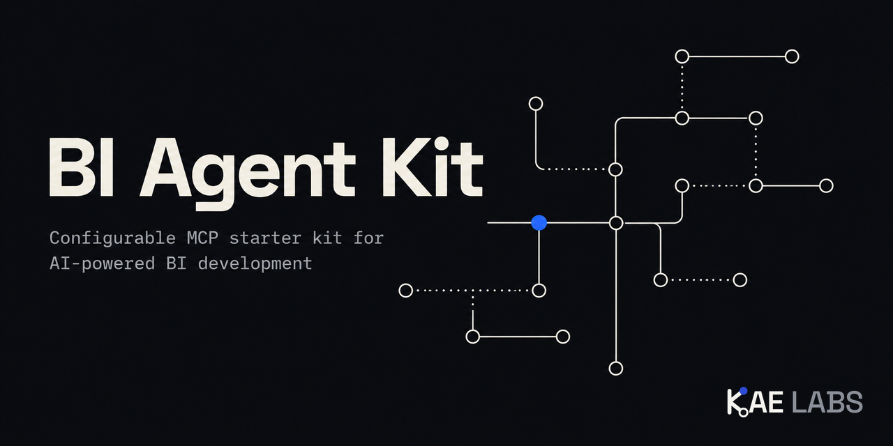

<div align="center">
  
</div>

# bi-agent-kit

**A configurable installer for AI-agent tooling aimed at Business Intelligence work.**

`bi-agent-kit` installs BI-related MCP server entries into the config files of the AI coding tools you already use -- Claude Code, Cursor, Gemini CLI, GitHub Copilot, and more -- without ever touching anything else already in those files.

Pick the servers you want, pick which tools to wire them into, and `bi-agent-kit` handles the rest: safe merges, atomic writes, an interactive walkthrough for anything that needs your own account details, and a manifest so entries can be cleanly added or removed later.

## Usage

No install step required.

```
npx bi-agent-kit init
```

Detects which supported AI tool config files exist in your project and your home directory, lets you pick which BI servers to add to which of them, walks you through any setup values a server needs (an org URL, a connection string, a token), and writes a manifest so it can cleanly add or remove entries later.

```
npx bi-agent-kit configure
```

Re-opens the same picker with current selections pre-checked, adds anything newly selected, and removes anything deselected -- as long as that entry has not been hand-edited since install.

```
npx bi-agent-kit list
```

Shows what `bi-agent-kit` currently has installed, and where.

Add `--dry-run` to `init` or `configure` to preview exactly what would be written or removed without touching any file or asking any setup questions.

## Supported AI tools

| Tool | Scope |
|---|---|
| Claude Code | project |
| Claude Desktop | user |
| Cursor | project + user |
| Gemini CLI | project + user |
| GitHub Copilot CLI | project + user |
| GitHub Copilot -- VS Code extension | workspace + user |
| OpenAI Codex CLI | project + user |

## Supported BI servers

| Server | What it is | Link |
|---|---|---|
| **Power BI MCP** | Semantic model authoring (TMSL/TOM) | [microsoft/powerbi-modeling-mcp](https://github.com/microsoft/powerbi-modeling-mcp) |
| **Dataverse MCP** | Dataverse hosted MCP endpoint | [Connect to Dataverse with MCP](https://learn.microsoft.com/en-us/power-apps/maker/data-platform/data-platform-mcp) |
| **PAC CLI MCP** | Built into the Power Platform CLI | [Power Platform CLI MCP server](https://learn.microsoft.com/en-us/power-platform/developer/howto/use-mcp) |
| **Fabric MCP** | Fabric REST APIs, item definitions, workspace operations | [Fabric MCP Server quickstart](https://learn.microsoft.com/en-us/rest/api/fabric/articles/mcp-servers/pro-dev-local/get-started-local) |
| **Azure MCP** | Broad Azure resource management (Storage, Key Vault, Cosmos DB, Azure SQL, and more) | [@azure/mcp on npm](https://www.npmjs.com/package/@azure/mcp) |
| **dbt MCP** | Build, run, docs, and lineage for a dbt project | [dbt-labs/dbt-mcp](https://github.com/dbt-labs/dbt-mcp) |
| **SQL Server MCP** | Azure SQL, SQL Server, PostgreSQL, MySQL, and Cosmos DB via Data API Builder | [SQL MCP Server quickstart](https://learn.microsoft.com/en-us/azure/data-api-builder/mcp/quickstart-visual-studio-code) |
| **Snowflake MCP** | Snowflake-managed remote MCP server (Cortex Agents) | [Snowflake MCP Server docs](https://docs.snowflake.com/en/user-guide/snowflake-cortex/cortex-agents-mcp) |
| **Postgres MCP** | Postgres database inspection, query, and index-tuning (Postgres MCP Pro) | [crystaldba/postgres-mcp](https://github.com/crystaldba/postgres-mcp) |

Eight of the nine are official, first-party servers from Microsoft or Snowflake, or maintained directly by the tool vendor (dbt Labs). Postgres MCP is the best-maintained community alternative, since no first-party Postgres MCP server exists. None are roadmap-only.

## Safety

`bi-agent-kit` never overwrites a config entry it does not already own. Before writing, it checks every target for a server already configured under the same name -- if you already have it set up by hand, or by some other tool, `bi-agent-kit` skips that entry entirely and leaves it exactly as it is, rather than overwriting or duplicating it. Every write is atomic, and the first time a target file is touched, a backup copy is kept in a `.bi-agent-kit-backups/` directory next to it.

That backups directory writes its own `.gitignore` (`*`) the first time it is created, so backups -- including any hand-configured secrets a pre-existing config file already had in it -- are excluded from version control regardless of your own `.gitignore` state.

Servers that require an external CLI to already be installed (PAC CLI for PAC CLI MCP, the `dab` CLI for SQL Server MCP) are flagged inline in the picker with a "not found on PATH" label if that CLI is not detected -- they are still offered, since you may install it before running the picker again, but the warning makes the missing prerequisite visible up front.

## License

MIT

---

Built by [KAE Labs](https://kaelabs.dev) -- an independent studio for applied AI, data, and software.
